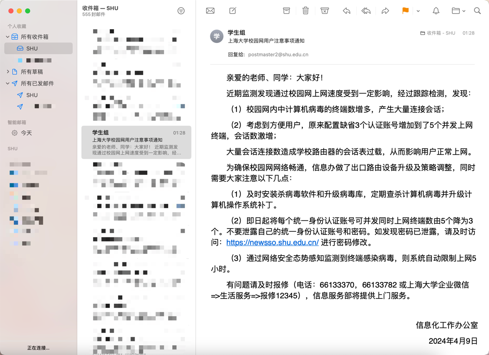

# ShuWlanForEveryone
校园网能不能活一下呀！！

# 免责声明

本项目的创建是为了学习、教育和研究目的。开发者不鼓励也不支持使用本项目进行任何形式的非法活动或行为。

本项目及其所有贡献者不对任何个人或团体使用本项目进行的任何非法活动承担责任。使用者应确保他们的行为遵守当地和国际法律，并且完全理解本项目的性质。

任何试图或实际使用本项目进行非法活动的行为，均与本项目及其贡献者无关。使用者对其行为的法律后果负全责。

# 为什么要做
早上查邮件的时候看到了这封邮件⬇️

我寻思这可咋整，我有七个终端需要网络喂养，还有只能连接五个小时。然后一激动写了个这个…很幼稚有点。

# 怎么用
1. 先克隆项目到本地
    ```Bash
    git clone https://github.com/zXiaoyuLuo/ShuWlanForEveryone.git
    ```
2. 修改配置文件(user.config, web.config)一般地，web.config不需要修改

3. 回到终端运行main.py
    ```Bash
    python main.py
    ```

# 项目原理
本项目是基于selenium进行的模拟登录，我的repositories里有相似的项目。

该项目是基于Google Chrome完成的，如果你用的Safari、Firefox、Edge等请自行修改[`auto_login.py`第11行](model%2Fauto_login.py)
# 扩展性

如果是Windows系统且为有线网可以考虑把项目转为.bat文件，并设置电脑开机自动运行。

Mac mini&Mac Studio等用户也可以做一个.sh的文件，我的是MacBook没钱买扩展坞所以必要搞。

对于Linux不太熟悉，在研究购买树莓派(想用树莓派做扩展作为路由器把三个终端改成一堆终端)

# 后续的更新

计划着下周抽空给项目加一个每多久自动重新运行一次，并加上其他的功能。
